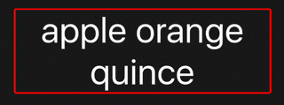
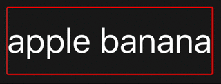
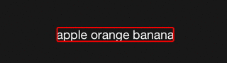
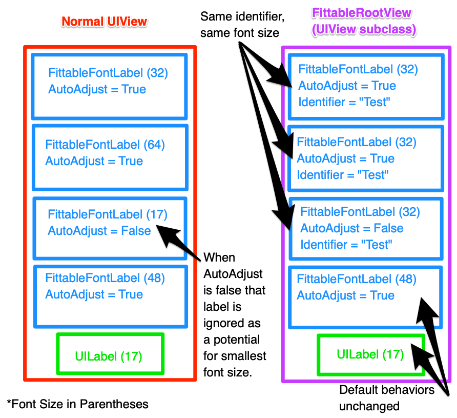

# FittableFontLabel

[](https://travis-ci.org/tbaranes/FittableFontLabel)

[](http://cocoadocs.org/docsets/FittableFontLabel)
[](https://github.com/tbaranes/FittableFontLabel)
[](https://github.com/Carthage/Carthage)

`UILabel` can shrink font size as follows:

```swift
label.minimumScaleFactor = 0.3
label.adjustsFontSizeToFitWidth = true
label.numberOfLines = 1
```

But it won't always work as expected: 

- Doesn't fit the label height
- Big top / bottom margins when the maxFontSize is huge
- Not really customisable
- Can't keep font size consistent across multiple labels
- ...

That's why `FittableFontLabel` exists:

- Make the text fit the label size: width and height if multilines, width only if single lines
- Works with one or several lines
- Supports attributed string (custom line spacing...)
- Customize `maxFontSize` without using default label font size
- Auto-layout compliant
- Keep font size consistent across multiple labels using 'FittableRootView'
- `UILabel` extension if we want to use `UILabel`
- Customisable from xibs / storyboards when using the UILabel's subclass `FittableFontLabel`
- ...

**Multilines `UILabel`:**



**Multilines `UILabel` with attributed string (lines spacing):**



**Single line `UILabel`:**



**Consistent font size across multiple labels `FittableRootView`**



## Usage

### FittableFontLabel
```swift
let aFittableFontLabel = FittableFontLabel(frame: CGRect(x: 0, y: 0, width: 300, height: 100))
aFittableFontLabel.autoFittableFont = true
aFittableFontLabel.lineBreakMode = .ByWordWrapping
aFittableFontLabel.numberOfLines = 0 // or 1...
aFittableFontLabel.text = "?"
// Change the text, it will always fit the label frame!
```

Check the sample project for advanced usage.

**Note:** The label `lineBreakMode` must be set to `NSLineBreakByWordWrapping` in order to work.

### FittableRootView
To get a consistent font size across multiple labels embed your FittableFontLabels in a `UIView` with the custom class `FittableRootView`. Then give each label you want to keep consistent the same link identifer. 

The FittableRootView acts as the root of a search for FittableFontLabels with link identifiers. Every FittableFontLabel with an identifier found by the search is updated to use the smallest auto adjusted font size calculated for that identifier.

**Notes:** 
- FittableRootView has an inspectable bool `searchView`. This allows you to disable the search, giving the `FittableRootView` identical behavior to a normal `UIView`. 
- You can use multiple identifiers to standardize the font size across multiple sets of labels within the same view.
- When AutoAdjustFontSize is false, that label's font size is ignored in the search for smallest font size. This way if you know which label is going to be longest (i.e. the smallest font size) you can avoid computing font sizes that will go unused while still keeping font size consistent.

## Installation

- iOS 8.0+

### CocoaPods

Add `pod FittableFontLabel` to your Podfile.

### Carthage

Add `github "tbaranes/FittableFontLabel"` to your Cartfile.

### Swift Package Manager

FittableFontLabel is available on SPM. Just add the following to your Package file:

```swift
// swift-tools-version:5.5.0
import PackageDescription

let package = Package(
    dependencies: [
        .Package(url: "https://github.com/tbaranes/FittableFontLabel.git", majorVersion: 1)
    ]
)
```

### Manual Installation

Just drag the `Source/*.swift` files into your project.


## UILabel extension

```swift
func fontSizeToFit(maxFontSize: CGFloat = 100, 
					  minFontScale: CGFloat = 0.1,
					  rectSize: CGSize? = nil)
```

Adjust the font size to make the current text fit the label frame.

- `maxFontSize`: the biggest font size to use during drawing. The default value is 100
- `minFontScale`: the scale factor that determines the smallest font size to use during drawing. The default value is 0.1
- `rectSize`: the size where the text must fit. The default value is the label bounds

```swift
func fontSizeThatFits(
        text string: String, 
        maxFontSize: CGFloat = 100, 
        minFontScale: CGFloat = 0.1,
        rectSize: CGSize? = nil) -> CGFloat
```

Returns the font size that can make the `text` parameter fit the label frame.

- `text`: the text that needs to fit in the label
- `maxFontSize`: the biggest font size that can be returned. The default value is 100
- `minFontScale`: the scale factor that determines the smallest font size that can be returned. The default value is 0.1
- `rectSize`: the size where the text must fit. The default value is the label bounds

## FittableFontLabel

An `UILabel` subclass allowing you to automatize the process of adjusting the font size.

```swift
@IBInspectable public var autoAdjustFontSize: Bool = true
```

If `true`, the font size will be adjusted each time that the `text` or the `frame` change.

```swift
@IBInspectable public var maxFontSize = CGFloat.NaN
```

The biggest font size to use during drawing. The default value is the current font size

```swift
@IBInspectable public var minFontScale = CGFloat.NaN
```

The scale factor that determines the smallest font size to use during drawing. The default value is 0.1

```swift
@IBInspectable public var leftInset: CGFloat = 0
@IBInspectable public var rightInset: CGFloat = 0
@IBInspectable public var topInset: CGFloat = 0
@IBInspectable public var bottomInset: CGFloat = 0
```

These four properties allow you to set a margin on your label. That will change the rect where the font must fit. The default value is 0.

## Contribution

- If you found a **bug**, open an **issue**
- If you have a **feature request**, open an **issue**
- If you want to **contribute**, submit a **pull request**

## Licence

`FittableFontLabel` is available under the MIT license. See the LICENSE file for more info.
